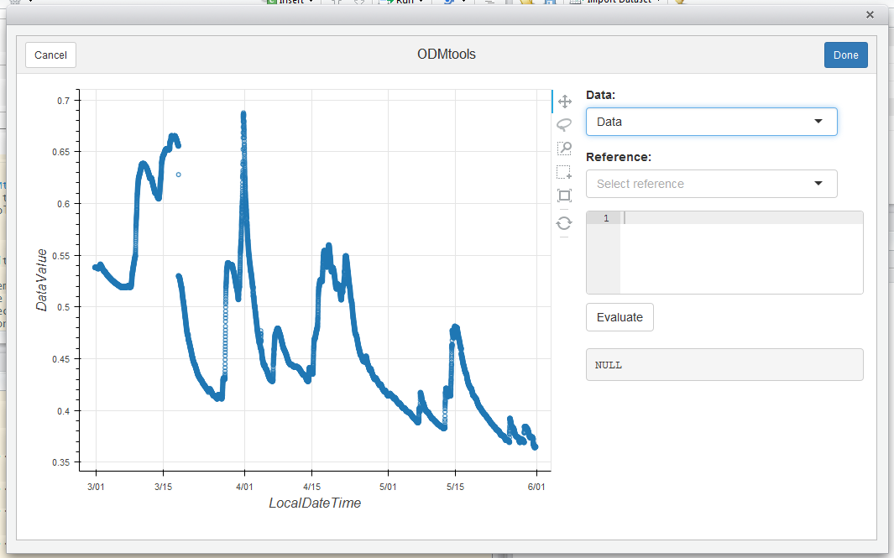

This is an R package for working with an instance of the CUAHSI ODM running on MS-SQL. Works in our office, may or may not be useful to others outside our work-site.

## ODBC

In order to talk to the database, you'll need to put an ODBC connection on the machine that you're working on. To do this, do Control Panel -> Administrative Tools, then choose "Data Sources (ODBC)". You'll want to add a "User DSN".

At this point, it'll ask you which driver you want to use. You'll want to choose SQL Server and click finish. Next you'll want to specify which database you want to talk to. You'll see a dialogue box with three boxes for you to fill in.

Click next and choose that you want to connect with SQL Server authentication using a username and password given to you by the administrator. 

Click "Next" again, and it'll contact the database to make sure that you have the appropriate permissions. Make sure that you have the “OD” database selected as the default database. Click next again, then finish, and finally, click "Test Data Source" to make sure that everything ran properly.

## The Basics
This will all be easier to use and understand if you have a fundamental understanding of the underlying data model. The model and the underlying motives for it's design can be found at http://www.cuahsi.org 

Here is a quick example. You'll need the package RODBC in order to establish a connection using an ODBC connection. `RODBC::odbcConnect` establishes a connection to the specified DSN and `ODMgetCatalog()` can be used to import the series catalog.

```{r} 
library(ODMr)
ODM <- odbcConnect("ODM", "update", "update")
Catalog = ODMgetCatalog()
```

Using the established connection and referencing the series catalog we can import data from the database. The series catalog is not stable so only use this method to quickly look at certain data.

```R
Data <- ODMselect(ODM, SeriesID = 10, startDate = "2013-06-01",
  endDate = "2014-06-01")
```

A more stable reference can be had by specifying SiteID, VariableID, MethodID and QualityControlLevelID.

```{r}
Data <- ODMselect(ODM, SiteID = 15, VariableID = 8, MethodID = 1, QCLevelID = 1,
                  startDate = "2016-03-01", endDate = "2016-06-01")
```

Multiple data series can be queried at once. The function makes use of the IN
operator in the underlying SQL statement to specify multiple values. 

```R
Data <- ODMselect(ODM, SiteID = c(1,5) , VariableID = 1, MethodID = 9,
  QCLevelID = 0, startDate = "2013-06-01", endDate = "2013-07-01")
```

## Addins

The are a number of addins included in the package. Once the package is installed they should be available under Addins on the main application toolbar of Rstudio.

`ODMconnect()` provides a simple GUI to establish a connection to the database. Hopefully in the future we'll store connection info to make it easier to reconnect to the database.

`ODMgetDataValues()` provides a simple GUI to access and download data from ODM. The addin will create and execute the code so that it can easily be saved and reused.

`ODMtools()` provides an interactive way of viewing, validating, and/or correcting values.

## Projects

Any process running on your computer has a notion of its "working directory". In R, this is where R will look, by default, for files you ask it to load. It is also where, by default, any files you write to disk will go. 

RStudio provides a very useful “project” feature that allows a user to switch quickly between projects. Each project may have different working directories and collection of files. The current project name is listed on the far right of the main application toolbar in a combobox that allows one to switch between an open project, open an existing project, or create a new project.

Do this: Within the project combobox select New Project. The directory name you choose here will be the project name. Call it whatever you want (good names are short and informative). Keep your "good" R code in a script for future reuse. Click on the floppy disk to save. Give it a name; it will go in the directory associated with your project.

## Visualising Data
Base graphics is the default graphics system in R, the easiest to learn to use, but is static.

```{r}
plot(Data$LocalDateTime, Data$DataValue)
```

The dygraphs package offers an R interface to the dygraphs JavaScript charting library. It provides rich facilities for charting time-series data in R, including interactive features including zoom/pan and series/point highlighting.

```{r}
library(dygraphs)
Data %>% 
  xts::xts(x = .$DataValue, order.by = .$LocalDateTime) %>% 
  dygraph()
```

You can also use the `ODMtools()` addin. It will recognize any dataframe that you have that fits the general structure of the ODM data values table. Specifically containing a LocalDateTime column and a Datavalue column.



## Editing data

Import data from the ODM database. Be sure to select a data series with the quality control level ID of 1. We can either manually build the call or use the `ODMgetDataValues()` addin to build the call for us. 

```R
PC1_Stage_10minAvg_1_1 <- 
  ODMselect(ODM, SiteID = 15, VariableID = 8, MethodID = 1, QCLevelID = 1)
```

You can also import data from external sources such as .csv files containing other observations. Use the "Import Dataset" functionality of Rstudio to get .csv data into R. If you import data from a .csv file, move it to the project directory you are working from so that it can be referred to at a later date if necessary.

Useful code bits that can be run in ODMtools

```R
values$Refdata %>% 
  mutate(LocalDateTime = floor_date(LocalDateTime, "hour"))%>% 
  inner_join(Data(), by = "LocalDateTime") %>% 
  mutate(Diff = DataValue.x - DataValue.y) %>% 
  select(Diff) %>% summary()

Data() %>%
  mutate(DataValue = DataValue - 0.108,
  QualifierID = 106) %>% 
  Data()
```

## Importing data into the ODM database

```R
library(readr)
PC1_CR1000_Weir <- read_csv("PC1_CR1000_Weir.dat", 
    col_types = cols(TIMESTAMP = col_datetime(format = "%Y-%m-%d %H:%M:%S")))
```

```R
PC1_new <- ODMcreate(PC1_CR1000_Weir$TIMESTAMP, PC1_CR1000_Weir$ShaftEnc_Avg, 
  SiteID = 15, VariableID = 8, MethodID = 1)
```

```R
ODMload(ODM,PC1_new, QCcheck = 0)
```

## Calculating Flow

```R
flow <- function(h, p, e, n) {
  p * (h - e) ^n
}

Q <-
  ifelse (Stage$DataValue > 0.534, flow(Stage$DataValue, 1241.9, 0.489, 1.32),
          ifelse (Stage$DataValue > 0.353, flow(Stage$DataValue, 985.52, 0.353, 2.26),
                  0))
```

## Combining Series

```R
comb <- PC1_Stage_10minAvg_1_1 %>% 
    left_join(PC1_Stage_10min_31_1[,c("LocalDateTime", "DataValue")], by = "LocalDateTime") %>%
    mutate(DataValue = ifelse(is.na(DataValue.x), DataValue.y, DataValue.x)) %>%
    dplyr::select(-DataValue.x, -DataValue.y)
```

## Example workflow – Manual Barometric Compensation

Convert the barometric data column from its barometric measurement units (typically atm, mm Hg, psi, mbar or kPa) to meters of water column equivalent. 

```R
PTMET_BarPre_10minAvg_2m_12_1 <- 
    ODMr::ODMselect(ODM, SiteID = 13, 
    VariableID = 100, MethodID = 12, QCLevelID = 1)
```

How many hPa in 1 meter of head? The answer is 98.04139432.

```R
Adj <- PTMET_BarPre_10minAvg_2m_12_1 %>% 
    mutate(DataValue = DataValue / 98.04139432)
```

Merge the barometric corrections with the stage data and calculate the corrected stage values.

```R
PC1_Stage_10minAvg_42_1 %>% 
    left_join(Adj[,c("LocalDateTime","DataValue")], by = "LocalDateTime") %>% 
    mutate(DataValue = DataValue.x - DataValue.y)
```

## Useful packages - lubridate

Parsing dates and times. Getting R to agree that your data contains the dates and times you think it does can be tricky. Lubridate simplifies that. Identify the order in which the year, month, and day appears in your dates. Now arrange “y”, “m”, and “d” in the same order.

```R
library(lubridate)
mdy("06-04-2011")
```

If your date includes time information, add h, m, and/or s to the name of the function.

```R
ymd_hms("2011-06-04 12:00:00")
```

Using paste to combine dates and times to create datetime objects.

```R
Date = "2011-06-04"
Time = "12:00:00"
ymd_hms(paste(Date, Time))
```

Rounding to the nearest unit or multiple of a unit are supported. All meaningful specifications in English language are supported - secs, min, mins, 2 minutes, 3 years etc.

```R
round_date(ymd_hms("2011-06-04 12:03:00"), unit = "10 minutes")
floor_date(ymd_hms("2011-06-04 12:03:00"), unit = "month")
ceiling_date(ymd_hms("2011-06-04 12:03:00"), unit = "10 minutes")
```

## Useful packages - robfilter

robfilter is a package of functions for robust extraction of an underlying signal from time series. The simplest and quickest functions to use in the package are those applying robust regression techniques to moving time windows.

```R
library(robfilter)
PC1_filtered <- robreg.filter(PC1_Stage_10minAvg_1_1$DataValue, width = 7)
plot(PC1_filtered)
```
robreg.filter returns an object of class robreg.filter containing the signal level extracted by the filter(s) specified.

## Useful packages - padr

When getting time series data ready for analysis, you might be confronted with the following two challenges:
-The observations are done on too low a level, e.g. time recorded to the second, where your analysis is on a daily level.
-There are no records for the time points where observations were absent.
padr aims to make light work of preparing time series data by offering the two main functions thicken and pad.

```R
library(padr)
PTMET_pad <- PTMET_BarPre_10minAvg_2m_12_1 %>% pad()
```
The pad function figures out what the datetime variable in the data frame is, and then assesses its interval. It inserts a row in the data frame for every time point that is lacking from the data set. All non-datetime values will get missing values at the added rows.

## Useful packages - zoo

In zoo there are a few useful NA functions in particular:
na.locf()
na.appox()
na.spline()

na.locf() stands for last observation carried forward and does just what it says. The last observation before NA or a string before NA is used to replace the NA. Runs of more than `maxgap` NAs are retained, other NAs are filled.

```R
library(zoo)
PTMET_pad %>% mutate(DataValue = na.locf(DataValue, maxgap = 1))
```

na.approx() uses linear interpolation to fill in missing values.

```R
PTMET_pad %>% mutate(DataValue = na.approx(DataValue, maxgap = 6))
```

na.spline() uses polynomial interpolation to fill in missing data.

```R
PTMET_filled <- PTMET_pad %>% mutate(DataValue = na.spline(DataValue, maxgap = 6))
```

Using tidyr you'll need to fill missing values in using the previous entry to ensure records contain all the required meta data fields like SiteID.

```R
library(tidyr)
PTMET_filled %>% fill(UTCOffset, SiteID, VariableID, MethodID, SourceID, QualityControlLevelID)
```

Visualize the dataset for missingness.

```R
library(ggplot2)
PTMET_filled %>% mutate(DataValue = is.na(DataValue)) %>%
    ggplot(aes(LocalDateTime, DataValue)) + geom_raster()
```

## Useful code bits - tsoutliers

From Rob Hyndman - "Here is a simple R function that will find time series outliers. It will handle seasonal and non-seasonal time series. The basic idea is to find robust estimates of the trend and seasonal components and subtract them. Then find outliers in the residuals. The test for residual outliers is the same as for the standard boxplot -- points greater than 1.5IQR above or below the upper and lower quartiles are assumed outliers. The number of IQRs above/below these thresholds is returned as an outlier "score". So the score can be any positive number, and will be zero for non-outliers."

```R
tsoutliers <- function(x)
{
    x <- as.ts(x)
    if(frequency(x)>1)
        resid <- stl(x,s.window="periodic",robust=TRUE)$time.series[,3]
    else
    {
        tt <- 1:length(x)
        resid <- residuals(loess(x ~ tt))
    }
    resid.q <- quantile(resid,prob=c(0.25,0.75))
    iqr <- diff(resid.q)
    limits <- resid.q + 1.5*iqr*c(-1,1)
    score <- abs(pmin((resid-limits[1])/iqr,0) + pmax((resid - limits[2])/iqr,0))
    return(score)
}
```

```R
OUT <- PTMET_BarPre_10minAvg_2m_12_1 %>%
    mutate(ol = tsoutliers(DataValue)) %>% 
    filter(ol > 1.5)
```
